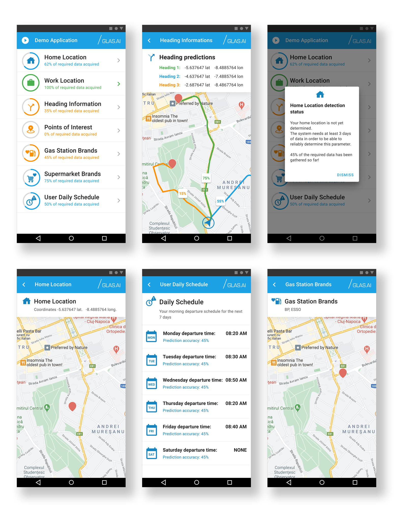

[![Contributors][contributors-shield]][contributors-url]
[![Forks][forks-shield]][forks-url]
[![Stargazers][stars-shield]][stars-url]
[![Issues][issues-shield]][issues-url]
[![MIT License][license-shield]][license-url]
[![LinkedIn][linkedin-shield]][linkedin-url]
 

  

  <h3 align="center">GLAS.AI Demo - Behavioral Predictor Android Sample App</h3>

  

    For GLAS.AI API documentation please check this page:
     
    <a href="https://docs.glas.ai"><strong>API Documentation</strong></a>
     
  

  

  
Table of Contents

  <ol>
    <li><a href="#about-the-project">About</a></li>
    <li><a href="#built-with">Built With</a></li>
    <li><a href="#getting-started">Getting Started</a></li>
    <li><a href="#installation">Installation</a></li></li>
    <li><a href="#usage">Usage</a></li>
    <li><a href="#roadmap">Roadmap</a></li>
    <li><a href="#contributing">Contributing</a></li>
    <li><a href="#license">License</a></li>
    <li><a href="#contact">Contact</a></li>
    <li><a href="#acknowledgements">Acknowledgements</a></li>
  </ol>

## About

This code is aimed at demonstrating part of the features of GLAS.AI framework. It focuses on showing how to integrate the GLAS.AI Android SDK in order to get access to the user behavior  analytics.

Why do  you need this:
* Learn how to integrate **Home location** and **Work location** predictions in your own application.
* Learn how to make use of the **Heading information** predictions.
* Learn how to get the users' **Favourite POI** locations and **Supermarket / Gas station Brands**.
* Learn how to get the user's daily **Home Departure Time** and its probability.

Sample code is provided in the application for all the above use cases.

### Built With

This project can be build wtih the following prerequisites
* [Android Studio V4.1.3](https://getbootstrap.com)
* [Android SDK api leven 26](https://jquery.com)

## Getting Started

Checkout the code, load the project in Android Studio and build it.

### Installation

You can either use Android Studio to build an PK and deploy it on your device, or you can download a pre-built APK from [here](https://google.com)

## Usage

Install the app, allow all requested permissions then leave it to work in the background of your Android smartphone for at least 2 weeks.

## Roadmap

See the [open issues](https://github.com/othneildrew/Best-README-Template/issues) for a list of proposed features (and known issues).

## Contributing

Contributions are what make the open source community such an amazing place to be learn, inspire, and create. Any contributions you make are **greatly appreciated**.

1. Fork the Project
2. Create your Feature Branch (`git checkout -b feature/AmazingFeature`)
3. Commit your Changes (`git commit -m 'Add some AmazingFeature'`)
4. Push to the Branch (`git push origin feature/AmazingFeature`)
5. Open a Pull Request

## License

Distributed under the **LGPL V3.0 License**. See `LICENSE` for more information.

The AAR library part is closed source.

## Contact

GLAS.AI Development Team -  development@glas.ai

Project Link: https://github.com/glas-ai/demo-app-predictive

<!-- MARKDOWN LINKS & IMAGES -->
<!-- https://www.markdownguide.org/basic-syntax/#reference-style-links -->

[contributors-shield]: https://img.shields.io/github/contributors/othneildrew/Best-README-Template.svg?style=for-the-badge
[contributors-url]: https://github.com/othneildrew/Best-README-Template/graphs/contributors
[forks-shield]: https://img.shields.io/github/forks/othneildrew/Best-README-Template.svg?style=for-the-badge
[forks-url]: https://github.com/othneildrew/Best-README-Template/network/members
[stars-shield]: https://img.shields.io/github/stars/othneildrew/Best-README-Template.svg?style=for-the-badge
[stars-url]: https://github.com/othneildrew/Best-README-Template/stargazers
[issues-shield]: https://img.shields.io/github/issues/othneildrew/Best-README-Template.svg?style=for-the-badge
[issues-url]: https://github.com/othneildrew/Best-README-Template/issues
[license-shield]: https://img.shields.io/github/license/othneildrew/Best-README-Template.svg?style=for-the-badge
[license-url]: https://github.com/othneildrew/Best-README-Template/blob/master/LICENSE.txt
[linkedin-shield]: https://img.shields.io/badge/-LinkedIn-black.svg?style=for-the-badge&logo=linkedin&colorB=555
[linkedin-url]: https://linkedin.com/in/othneildrew
[product-screenshot]: images/screenshot.png

